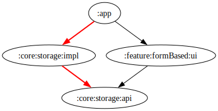
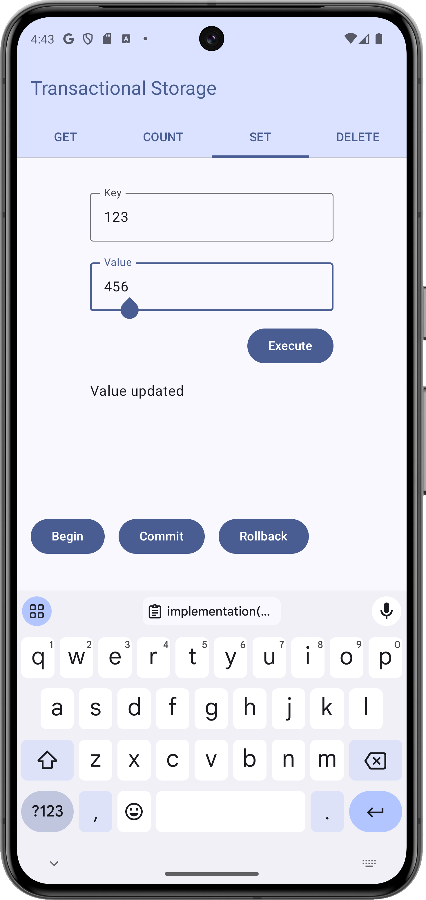

# Test assignment. Transactional key-value storage

## Stack
- :core:storage:* - pure jvm modules with no extra dependencies except of junit and coroutines runtime
- :app and :feature - Compose, Material3, Hilt
- project level - Gradle convention plugins, Spotless, Github Actions

## Structure

- :core:storage:api - Storage Interfaces
- :core:storage:impl - Storage implementation and tests
- :app - Android entry point and modules wiring
- :feature:formBased:ui - Form based user interface to manipulate storage

## Quick links
- [StorageImpl](core/storage/impl/src/main/kotlin/org/zayass/assessment/storage/core/Storage.kt)
- [StorageTest](core/storage/impl/src/test/kotlin/org/zayass/assessment/storage/core/StorageTest.kt)

## Preview
